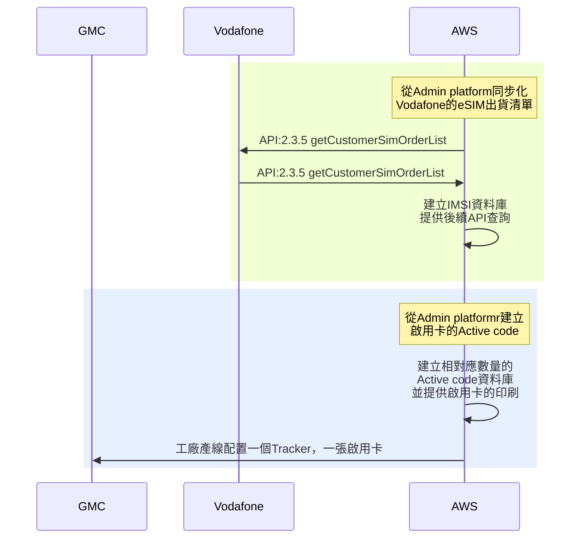
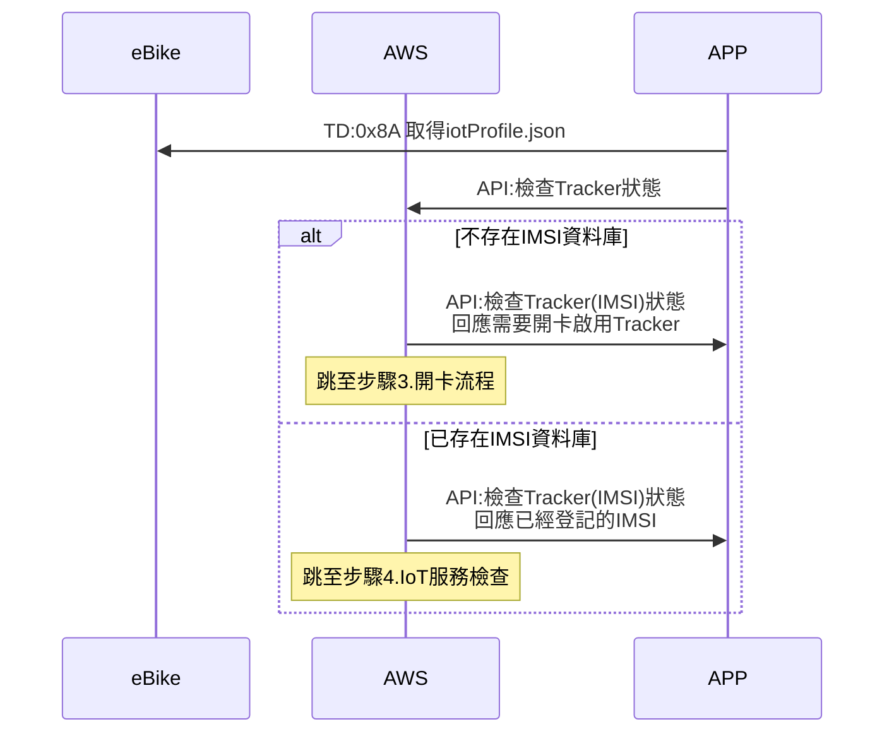
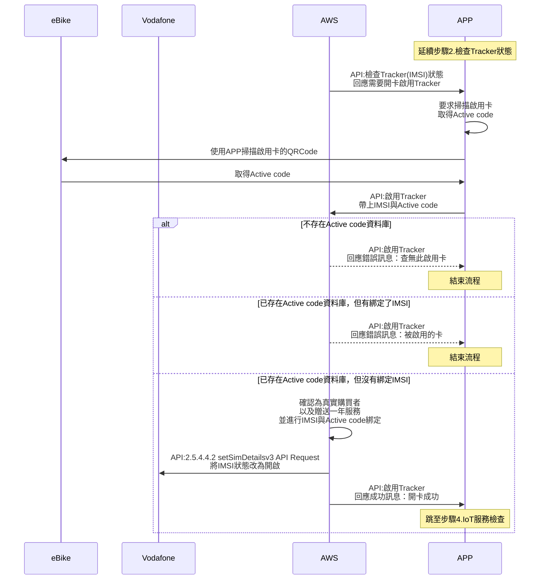
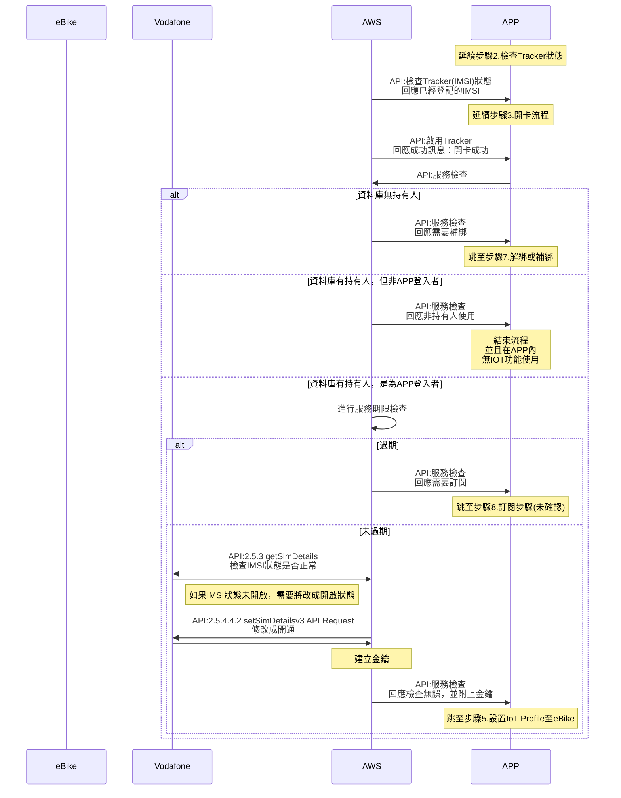
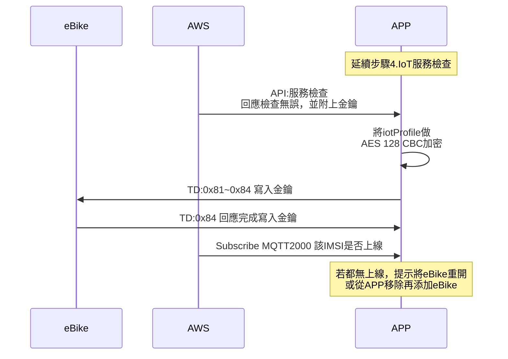
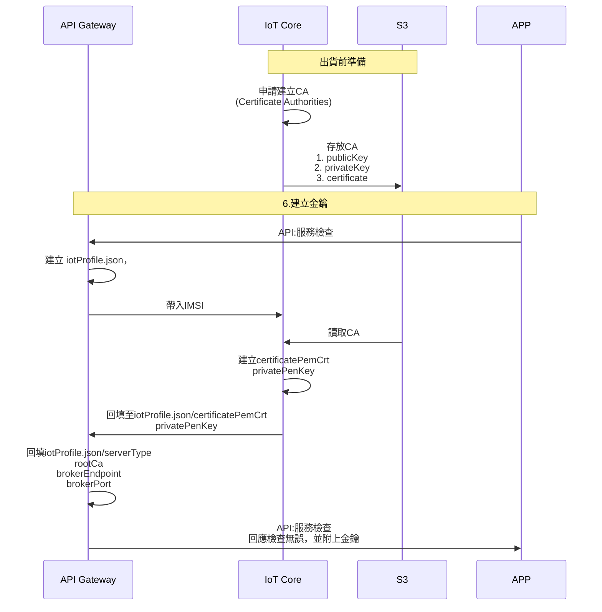
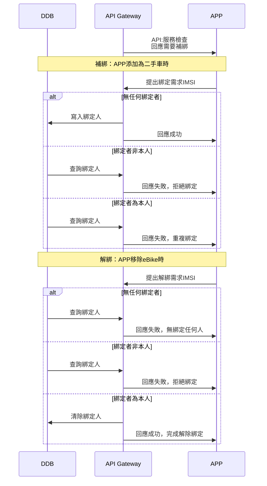
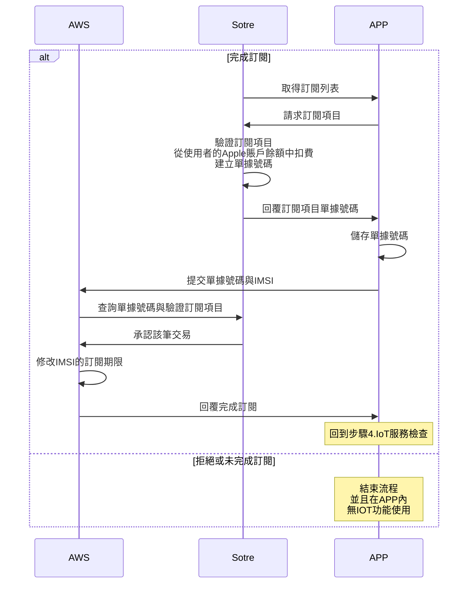
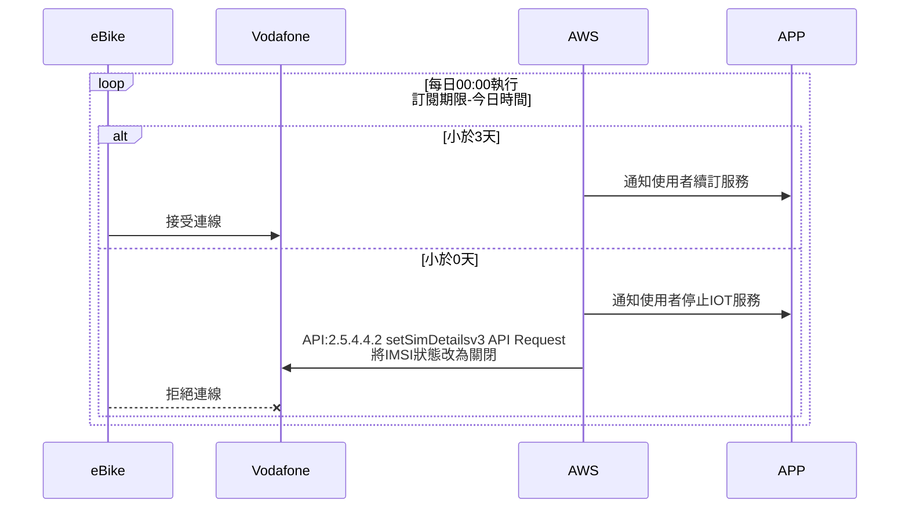

### 版本

| 日期       | 版本名稱 | 版號(ver) | 說明 |
| ---------- | -------- | --------- | ---- |
| 2021/10/22 | 1.0      | 1         | 初版 |

### API

#### 1400 檢查Tracker狀態

#### 1300 啟用Tracker

#### 1400 服務檢查

#### 1400 解綁或補綁

### 流程圖

#### 1.前置作業-eSIM與啟用卡建立

#### 2.檢查Tracker狀態

#### 3.啟用Tracker

#### 4.IoT服務檢查

#### 5.設置IoT Profile至eBike

#### 6.建立金鑰

#### 7.解綁或補綁

#### 8.訂閱步驟(未確認)

#### 9.檢查訂閱期限

