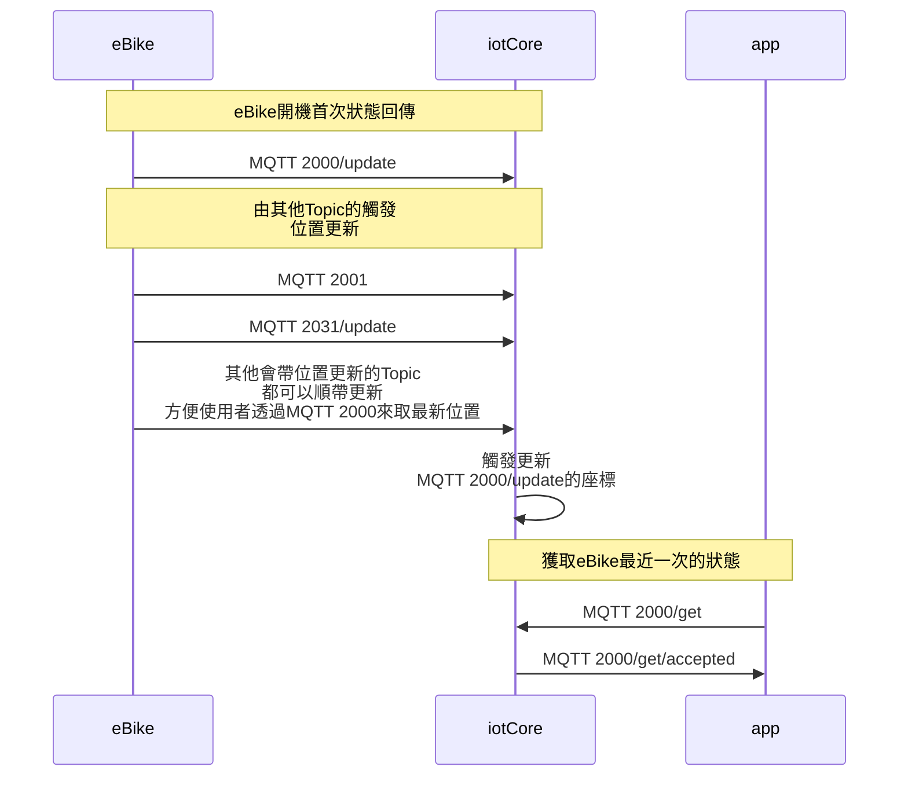

[TOC]

### 版本

| 日期       | 版本名稱 | 版號(ver) | 說明 |
| ---------- | -------- | --------- | ---- |
| 2021/10/25 | 1.0      | 1         | 初版 |

### 敘述

> API Code： 2000
>
> Topic:：$aws/things/`thingName`/shadow
>
> QoS： Level 1
>
> Description：將此車的需要用class shadow 的觸發資訊做上傳。例如有GIANT platform的搜索或篩選，IoT job的觸發。


### 應用設置

| keyName                         | valueType       | unit | Description                                           |
| ------------------------------- | --------------- | ---- | ----------------------------------------------------- |
| ver                             | number          |      | **必帶**，API 版本號，填上製作此API的當時版本號       |
| bikeProfile.                    | object          |      | 搜索車輛的需求                                        |
| bikeProfile.frameNumber         | string          |      | **必填**，車身號碼                                    |
| bikeProfile.bleAddress          | string          |      | **必填**，藍芽位址，不用帶冒號 ex. 5914F5EC8C6A       |
| bikeProfile.imsi                | string          |      | **必填**，imsi國際行動裝置辨識碼 ex.55478941254562978 |
| iotProfile.                     | object          |      |                                                       |
| iotProfile.serviceTermTimestemp | number          |      | Iot服務到期時段，會判斷此key來決定是否停止服務        |
| iotProfile.countryCode          | string          |      | 該裝置所在的國家，依ISO 3166-1二位字母代碼            |
| dynamic.                        | object          |      | 顯示GIANT platform車輛分布圖需求                      |
| dynamic.longitude               | number          | °    | 該車所在經度。                                        |
| dynamic.latitude                | number          | °    | 該車所在緯度。                                        |
| ePartList[].                    | array of string |      | eParts清單，用來觸發IoT job的需求                     |
| eParts.                         | Object          |      | 已安裝的eParts配置文件，                              |
| eParts.rideControl.             | Object          |      | ePart類型：核心控制器。                               |
| eParts.rideControl.name         | string          |      | 該ePart名稱：??????名稱Model id 比對?????             |
| eParts.rideControl.version      | number          |      | 該ePart版本                                           |
| eParts.remote1.                 | Object          |      | ePart類型：按鈕遙控器1。                              |
| eParts.remote1.name             | string          |      | 該ePart名稱                                           |
| eParts.remote1.version          | number          |      | 該ePart版本                                           |
| eParts.remote2.                 | Object          |      | ePart類型：按鈕遙控器2。                              |
| eParts.remote2.name             | string          |      | 該ePart名稱                                           |
| eParts.remote2.version          | number          |      | 該ePart版本                                           |
| eParts.display.                 | Object          |      | ePart類型：顯示器                                     |
| eParts.display.name             | string          |      | 該ePart名稱                                           |
| eParts.display.version          | number          |      | 該ePart版本                                           |
| eParts.syncDrive.               | Object          |      | ePart類型：馬達                                       |
| eParts.syncDrive.name           | string          |      | 該ePart名稱                                           |
| eParts.syncDrive.version        | number          |      | 該ePart版本                                           |
| eParts.canController.           | Object          |      | ePart類型：can控制器                                  |
| eParts.canController.name       | string          |      | 該ePart名稱                                           |
| eParts.canController.version    | number          |      | 該ePart版本                                           |
| eParts.bbss.                    | Object          |      | ePart類型：中軸傳感器                                 |
| eParts.bbss.name                | string          |      | 該ePart名稱                                           |
| eParts.bbss.version             | number          |      | 該ePart版本                                           |
| eParts.energyPak.               | Object          |      | ePart類型：主電池                                     |
| eParts.energyPak.name           | string          |      | 該ePart名稱                                           |
| eParts.energyPak.version        | number          |      | 該ePart版本                                           |
| eParts.energyPakPlus.           | Object          |      | ePart類型：副電池                                     |
| eParts.energyPakPlus.name       | string          |      | 該ePart名稱                                           |
| eParts.energyPakPlus.version    | number          |      | 該ePart版本                                           |
|                                 |                 |      | ==是不是要新增ePart類型：追蹤器、數據機?==            |
|                                 |                 |      | ==該ePart名稱==                                       |
|                                 |                 |      | ==該ePart版本==                                       |


### 規則引擎

#### 檢查eBike上的ePart更新需求

> Subscribe: $aws/things/`thingName`/shadow

```
當
    eParts.rideControl. = jodsGroud.eParts.rideControl.
    &&
    eParts.rideControl.name = jodsGroud.eParts.rideControl.name
    &&
    eParts.rideControl.version < jodsGroud.eParts.rideControl.version
則 
	觸發進入該jodsGroud
```

### Json範例


#### eBike開機時的首次狀態回傳
> Publish： $aws/things/`thingName`/shadow/update

```json
{
  "state": {
    "desired": {
      "ver": 1,
      "bikeProfile": {
        "frameNumber": "ECAA0000",
        "bleAddress": "00:00:00:00:00:00",
        "imsi": "154189238417043"
      },
      "iotProfile":{
          "serviceTermTimestemp":6511651141,
          "countryCode": "TW"
      },
      "dynamic": {
        "longitude": 120.1545454,
        "latitude": 56.56114111
      },
      "ePartList":[
          "ONE",
          "ONE"
      ],
      "eParts": {
        "rideControl": {
          "name": "ePartxxx",
          "version": 20211005
        },
        "remote1": {
          "name": "ePartxxx",
          "version": 20211005
        },
        "remote2": {
          "name": "ePartxxx",
          "version": 20211005
        },
        "dispaly": {
          "name": "ePartxxx",
          "version": 20211005
        },
        "syncDrive": {
          "name": "ePartxxx",
          "version": 20211005
        },
        "canController": {
          "name": "ePartxxx",
          "version": 20211005
        },
        "bbss": {
          "name": "ePartxxx",
          "version": 20211005
        },
        "energyPak": {
          "name": "ePartxxx",
          "version": 20211005
        },
        "energyPakPlus": {
          "name": "ePartxxx",
          "version": 20211005
        }
      }
    }
  }
}
```

#### app詢問裝置最近狀態回傳

>  Publish： $aws/things/`thingName`/shadow/get/accepted

```json
{
  "state": {
    "desired": {
      "ver": 1,
      "bikeProfile": {
        "frameNumber": "ECAA0000",
        "bleAddress": "00:00:00:00:00:00",
        "imsi": "154189238417043"
      },
      "iotProfile": {
        "serviceTermTimestemp": 6511651141,
        "countryCode": "TW"
      },
      "dynamic": {
        "longitude": 120.1545454,
        "latitude": 56.56114111
      },
      "ePartList": [
        "ONE",
        "ONE"
      ],
      "eParts": {
        "rideControl": {
          "name": "ePartxxx",
          "version": 20211005
        },
        "remote1": {
          "name": "ePartxxx",
          "version": 20211005
        },
        "remote2": {
          "name": "ePartxxx",
          "version": 20211005
        },
        "dispaly": {
          "name": "ePartxxx",
          "version": 20211005
        },
        "syncDrive": {
          "name": "ePartxxx",
          "version": 20211005
        },
        "canController": {
          "name": "ePartxxx",
          "version": 20211005
        },
        "bbss": {
          "name": "ePartxxx",
          "version": 20211005
        },
        "energyPak": {
          "name": "ePartxxx",
          "version": 20211005
        },
        "energyPakPlus": {
          "name": "ePartxxx",
          "version": 20211005
        }
      }
    },
    "metadata": {
      "desired": {
        "ver": {
          "timestamp": 1633318680045
        },
        "bikeProfile": {
          "frameNumber": {
            "timestamp": 1633318680045
          },
          "bleAddress": {
            "timestamp": 1633318680045
          },
          "imsi": {
            "timestamp": 1633318680045
          }
        },
        "iotProfile": {
          "serviceTermTimestemp": {
            "timestamp": 1633318680045
          },
          "countryCode": {
            "timestamp": 1633318680045
          }
        },
        "dynamic": {
          "longitude": {
            "timestamp": 1633318680045
          },
          "latitude": {
            "timestamp": 1633318680045
          }
        },
        "ePartList": {
          "timestamp": 1633318680045
        },
        "eParts": {
          "rideControl": {
            "name": {
              "timestamp": 1633318680045
            },
            "version": {
              "timestamp": 1633318680045
            }
          },
          "remote1": {
            "name": {
              "timestamp": 1633318680045
            },
            "version": {
              "timestamp": 1633318680045
            }
          },
          "remote2": {
            "name": {
              "timestamp": 1633318680045
            },
            "version": {
              "timestamp": 1633318680045
            }
          },
          "dispaly": {
            "name": {
              "timestamp": 1633318680045
            },
            "version": {
              "timestamp": 1633318680045
            }
          },
          "syncDrive": {
            "name": {
              "timestamp": 1633318680045
            },
            "version": {
              "timestamp": 1633318680045
            }
          },
          "canController": {
            "name": {
              "timestamp": 1633318680045
            },
            "version": {
              "timestamp": 1633318680045
            }
          },
          "bbss": {
            "name": {
              "timestamp": 1633318680045
            },
            "version": {
              "timestamp": 1633318680045
            }
          },
          "energyPak": {
            "name": {
              "timestamp": 1633318680045
            },
            "version": {
              "timestamp": 1633318680045
            }
          },
          "energyPakPlus": {
            "name": {
              "timestamp": 1633318680045
            },
            "version": {
              "timestamp": 1633318680045
            }
          }
        }
      }
    }
  }
}
```


### 流程圖

#### eBike更新狀態

