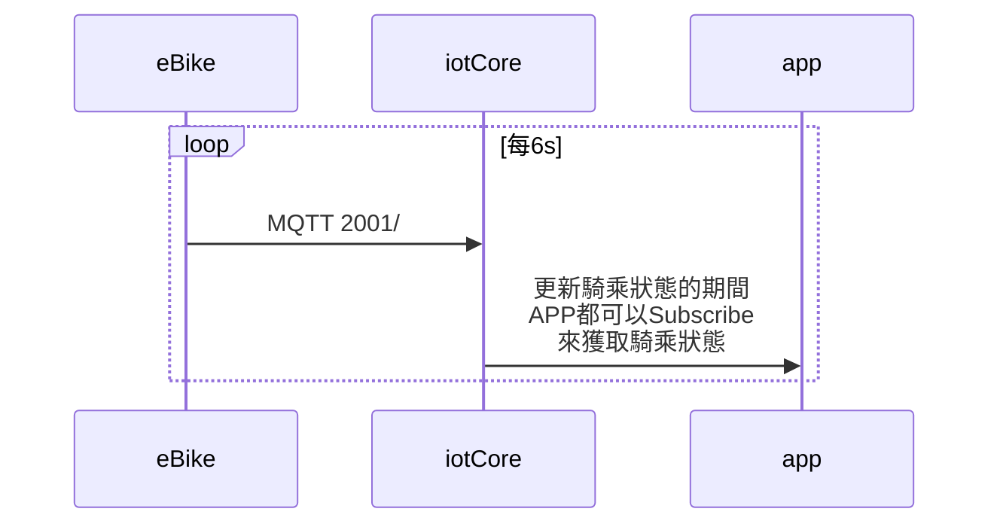

### 版本

| 日期       | 版本名稱 | 版號(ver) | 說明 |
| ---------- | -------- | --------- | ---- |
| 2021/10/22 | 1.0      | 1         | 初版 |

### 敘述

> API Code： 2001
>
> Topic:：$aws/things/`thingName`/dynamic
>
> QoS： Level 0
>
> Description：及時回傳E-Bike騎乘中的位置、高度、狀態...等相關資訊


### 應用設置

| keyName                    | valueType | unit   | Description                                                  |
| -------------------------- | --------- | ------ | ------------------------------------------------------------ |
| unixTimestemp              | number    |        | **必填**，車現地unix時間                                     |
| status                     | number    | --     | **必填**，車輛狀態:<br />1:待機<br />2:助推中<br />3:騎乘中<br />4:充電中 |
| mainBattery                | number    | %      | 主電池電量百分比                                             |
| plusBattery                | number    | %      | 外掛電池電量百分比                                           |
| distanceMeter              | number    | m      | 該次開機後的移動距離公尺                                     |
| longitude                  | number    | °      | 經度                                                         |
| latitude                   | number    | °      | 緯度                                                         |
| altitude                   | number    | m      | 海拔                                                         |
| speedFromBike              | number    | km/h   | 速度(依輪徑與踏頻)                                           |
| speedFromGps               | number    | km/h   | 速度(依GPS)                                                  |
| cadence                    | number    | number | 踏頻                                                         |
| rideAssistPercentage       | number    | %      | 助力百分比                                                   |
| totalPower                 | number    | w      | 總功率(腿+馬達)                                              |
| netPower                   | number    | w      | 淨功率(僅有腿)                                               |
| heartRate                  | number    | bpm    | 心率                                                         |
| gravityX                   | number    | g      | 重力感應器X軸                                                |
| gravityY                   | number    | g      | 重力感應器Y軸                                                |
| gravityZ                   | number    | g      | 重力感應器Z軸                                                |
| temperature                | number    | °C     | 溫度                                                         |
| localPressure              | number    | hpa    | 現地氣壓                                                     |
| seaLevelPressure           | number    | hpa    | 海平面氣壓                                                   |
| slope                      | number    | %      | 坡度                                                         |
| totalClimb                 | number    | m      | 累積爬升                                                     |
| totaldecline               | number    | m      | 累積下降                                                     |
| climbSpeed                 | number    | km/h   | 爬升速度                                                     |
| declineSpeed               | number    | km/h   | 下降速度                                                     |
| gpsHorizontalAccuracyMeter | number    | m      | GPS水平誤差值                                                |
| gpsVerticalAccuracyMeter   | number    | m      | GPS垂直誤差值                                                |
| numberOfSatellites         | number    | --     | 可用的衛星數                                                 |
| lteSignalStrength          | number    | dBm    | LTE訊號強度                                                  |


### 規則引擎

#### 更新eBike狀態

> Subscribe: $aws/things/`thingName`/dynamic

```
當
	longitude,latitude有帶並且非為空的
則 
	更新MQTT2000/update: dynamic.longitude,latitude
```

### Json範例


#### 騎乘狀態回傳或接收
> Publish： $aws/things/`thingName`/dynamic
>
> Subscribe： $aws/things/`thingName`/dynamic

```json
{
  "unixTimestemp": 1489097434407,
  "status": 3,
  "mainBattery": 95,
  "distanceMeter": 1544,
  "longitude": 120.6096578,
  "latitude": 24.2095305,
  "altitude": 125,
  "speedFromBike": 12.2,
  "speedFromGps": 13,
  "cadence": 123,
  "rideAssistPercentage": 120,
  "totalPower": 242,
  "netPower": 110,
  "gpsHorizontalAccuracyMeter": 50,
  "numberOfSatellites": 5,
  "lteSignalStrength": -55
}
```


### 流程圖

#### eBike更新狀態



