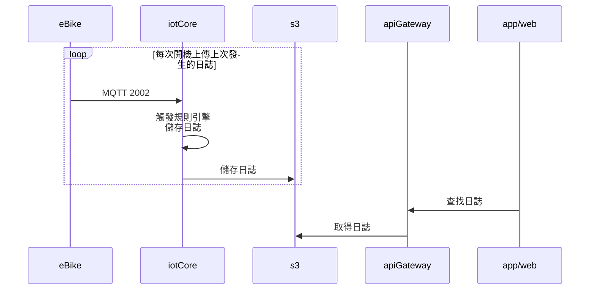

### 版本

| 日期       | 版本名稱 | 版號(ver) | 說明 |
| ---------- | -------- | --------- | ---- |
| 2021/10/26 | 1.0      | 1         | 初版 |

### 敘述

> API Code： 2002
>
> Topic:：$aws/things/`thingName`/eBikeLog
>
> QoS： Level 1
>
> Description： E-Bike的E-part資訊與其所累積的裝置日誌，可以在特定時機，透過Topic來做一次性的回傳，存放至DDB。至於log上傳時間點，建議在開機後有連線，會將上一次開機所產生的log做上傳。


### 應用設置

| keyName     | valueType       | maxByte | Description                                                  |
| ----------- | --------------- | ------- | ------------------------------------------------------------ |
| [].         | array of object |         |                                                              |
| timeStamp   | number          | 10      | **必填**，[unix時間](https://en.wikipedia.org/wiki/Unix_time)戳記 |
| messageCode | string          | 16      | 訊息代碼，需做建表控管，至附表的[messageCode](#messageCode)查詢代碼代表含意。 |
| comment     | string          | 32      | 可由開發人員自帶註解或參數                                   |

### 規則引擎

#### 儲存log

> Subscribe: $aws/things/`thingName`/eBikeLog

```
當
	[].timeStamp有帶並且非為空的
則 
	儲存[].到thingName/eBikeLog/yyyymmdd的目錄
```

### Json範例


#### 上傳裝置日誌
> Publish： $aws/things/`thingName`/eBikeLog
>
> Subscribe： $aws/things/`thingName`/dynamic

```json
[
    {
        "timeStamp":6511651141,
        "messageCode":"A4511",
        "comment":"5.9km/h"
    },
    {
        "timeStamp":6511658970,
        "messageCode":"A4511",
        "comment":"3.9km/h"
    }
]
```


### 流程圖

#### eBike上傳日誌



