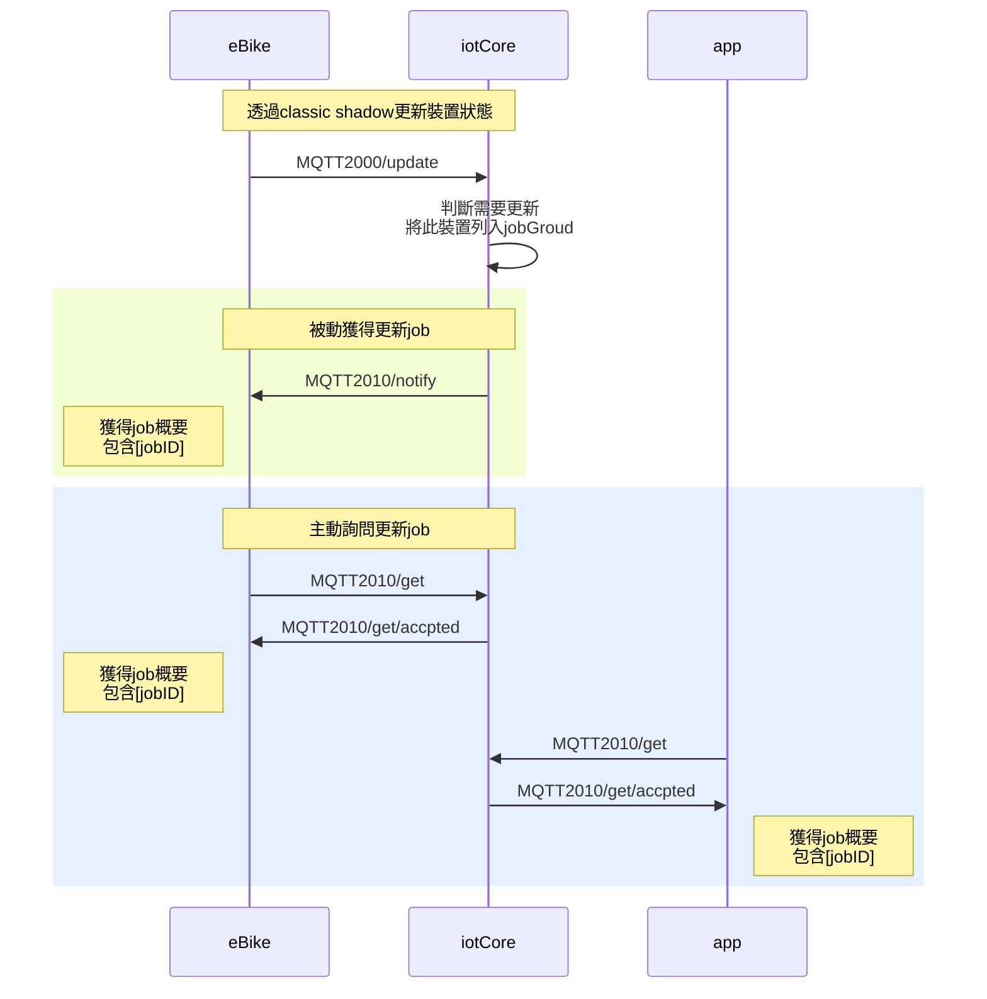
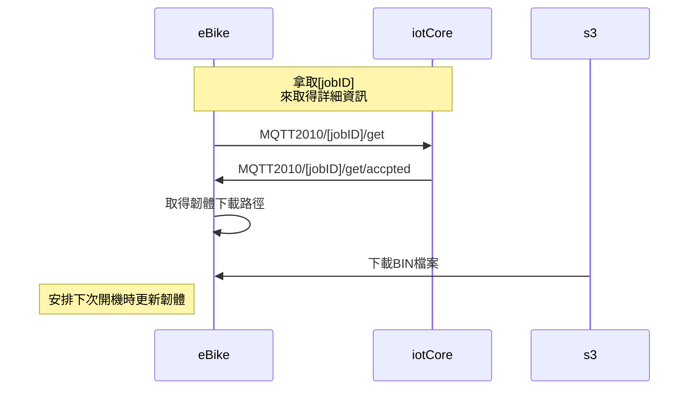
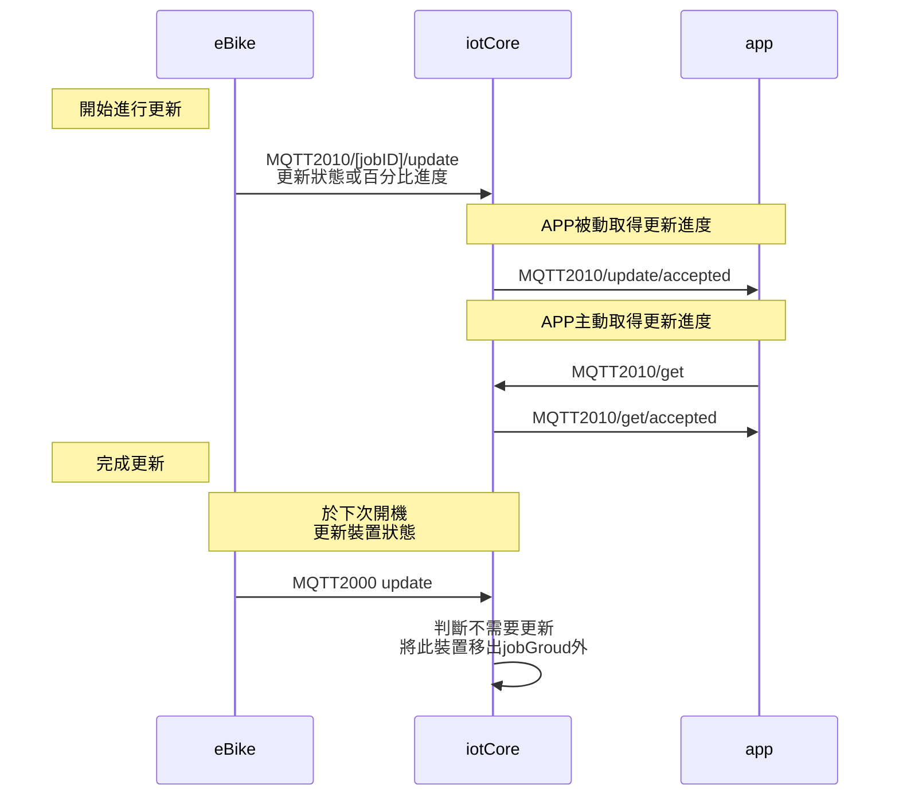

### 版本

| 日期       | 版本名稱 | 版號(ver) | 說明 |
| ---------- | -------- | --------- | ---- |
| 2021/10/22 | 1.0      | 1         | 初版 |

### 敘述

> API Code： 2010
>
> Topic:：$aws/things/`thingName`/jobs
>
> QoS： Level 1
>
> Description：可以獲取韌體更新需求、韌體更新的詳細敘述以及裝置可對iotCore更新韌體進度，韌體的更新需求，是透過`2000-eBike狀態`來做觸發

### 應用設置

> 自設應用JSON內容，為`jobDocument.`物件的內容

| keyName      | valueType | Description              |
| ------------ | --------- | ------------------------ |
| ePartName    | string    | 更新任務的e-Part名稱     |
| AES128CBC    | string    | 更新檔的AES128-CBC檢查碼 |
| downloadLink | string    | 更新檔的下載連結         |
| description  | string    | 更新檔的敘述             |


### Json範例

#### eBike取得jobs概要

裝置主動取得jobs概要

>  Publish:  $ aws/things/`thingName`/jobs/get

```
{}
```

裝置主動或被動獲取jobs概要

> Subscribe: $ aws/things/`thingName`/jobs/get/accepted
>
> Subscribe: $ aws/things/`thingName`/jobs/notify

```json
{
  "timestamp": 1633400851,
  "inProgressJobs": [],
  "queuedJobs": [
    {
      "jobId": "[ePartName]_SIas5g119w1g6a54d654fasdf",
      "queuedAt": 1631965704,
      "lastUpdatedAt": 1631965704,
      "executionNumber": 3,
      "versionNumber": 1
    }
  ]
}
```

#### eBike取得jobsID詳細資訊

獲取jobsID詳細資訊

>  Publish： $ aws/things/`thingName`/jobs/`jobsID`/get


```json
{}
```

回應jobsID詳細資訊

> Subscribe： $ aws/things/`thingName`/jobs/`jobsID`/get/accepted

```json
{
  "timestamp": 1489097434407,
  "execution": {
    "jobId": "123",
    "status": "QUEUED",
    "queuedAt": 1489097374841,
    "lastUpdatedAt": 1489097374841,
    "versionNumber": 1,
    "jobDocument": {
      "ePartName": "EVO",
      "AES128CBC": "ee0e79c370714a7133ea6f79b6a1744c1bf5ef286503d09a0c5ed035a5628f8e",
      "downloadLink": "${aws:iot:s3-presigned-url:http:***/***.bin}",
      "description": "HyRead APK 20210922"
    }
  }
}
```

#### eBike回報更新進度或狀態

> Publish： $ aws/things/`thingName`/jobs/`jobsID`/update

```json
{
    "status":"IN_PROGRESS",
    "statusDetails": {
        "IN_PROGRESS":"50%"
    },
    "expectedVersion":"1"
}
```

#### app取的eBike更新進度或狀態

>  Publish： $ aws/things/`thingName`/jobs/`jobsID`/get


```json
{
    "includeJobDocument":false
}
```

回應jobsID詳細資訊

> Subscribe： $ aws/things/`thingName`/jobs/`jobsID`/get/accepted

```
{
  "timestamp": 1489097434407,
  "execution": {
    "jobId": "123",
    "status": "IN_PROGRESS",
    "statusDetails": {
      "IN_PROGRESS": "50%"
    },
    "queuedAt": 1489097374841,
    "lastUpdatedAt": 1489097374841,
    "versionNumber": 1
  }
}
```


### 流程圖

#### eBike取得韌體更新概要(主動,被動)

#### eBike取得韌體更新詳細資訊


#### eBike回報韌體更新狀態與進度


