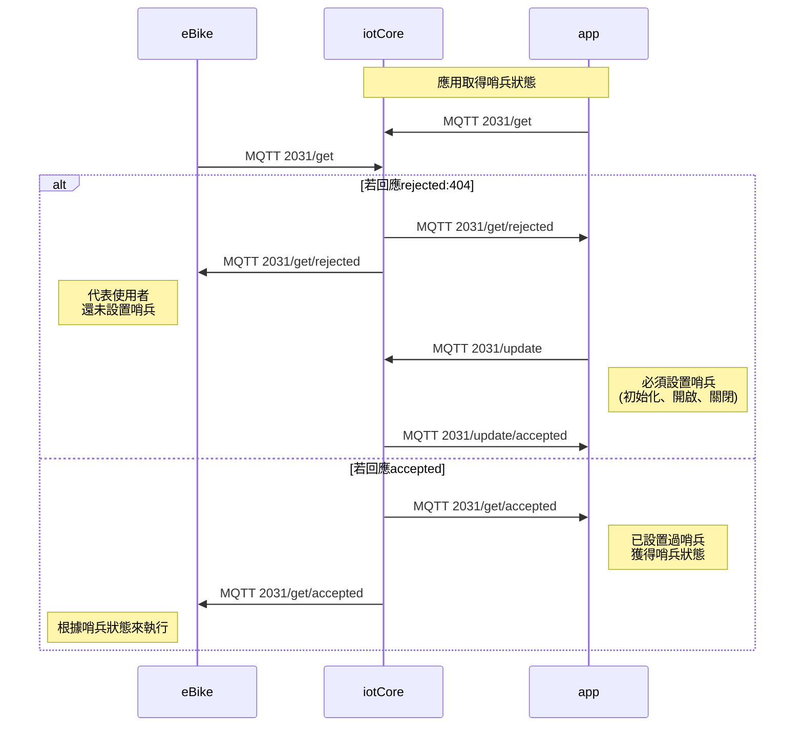
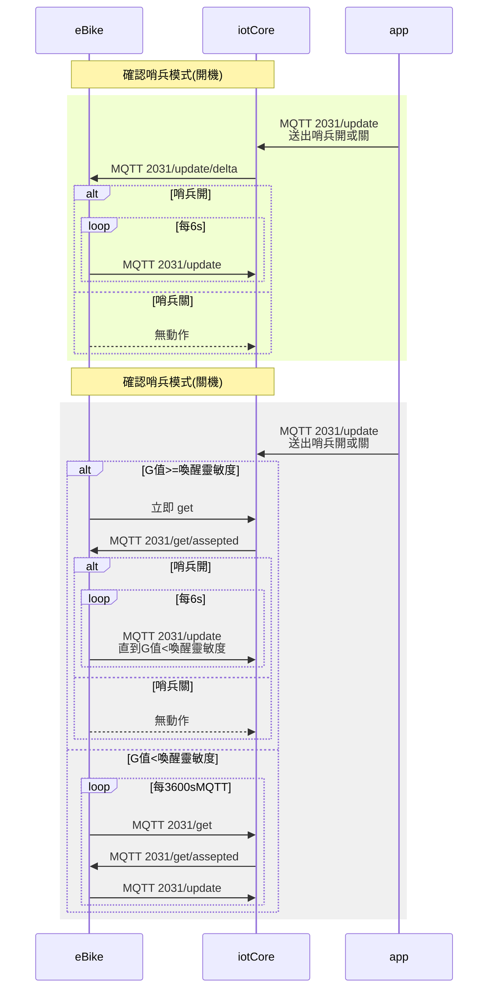
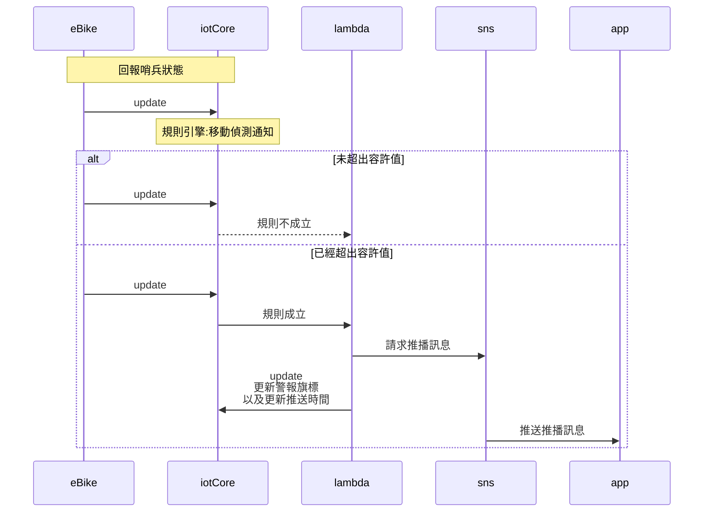

### 版本

| 日期       | 版本名稱 | 版號(ver) | 說明 |
| ---------- | -------- | --------- | ---- |
| 2021/10/22 | 1.0      | 1         | 初版 |

### 敘述

> API Code： 2031
>
> Topic:：$aws/things/`thingName`/shadow/name/sentry
>
> QoS： Level 1
>
> Description：開啟哨兵可以監看移動警報(GPS)、移動警報(輪徑*踏頻)、車倒警報


### 應用設置

> 自設應用JSON內容

| keyName                     | valueType | unit | Description                                                  |
| --------------------------- | --------- | ---- | ------------------------------------------------------------ |
| ver                         | number    |      | **必帶**，Shadow 版本號，製作此Shadow的當時版本號            |
| status                      | number    |      | 是否開啟哨兵。0:關, 1:開                                     |
| wakeUpSensitivity           | number    |      | 開關喚醒靈敏度。`0`-`10`，`0`為關機時不喚醒                  |
| longitude                   | number    | °    | 目前經度                                                     |
| latitude                    | number    | °    | 目前緯度                                                     |
| originLongitude             | number    | °    | 設置哨兵時的原始經度                                         |
| originLatitude              | number    | °    | 設置哨兵時的原始緯度                                         |
| distanceMeter               | number    | m    | 該次設置哨兵的移動距離公尺，此距離來自於輪徑與踏頻的計算量。 |
| radius                      | number    | °    | 最大容許移動範圍，由於是使用GPS十進位度數，所以在使用者介面要轉換單位為公尺，`0`為關閉移動偵測。`1度=111000公尺` |
| movementAlarm               | number    | --   | 移動警報。0:未發生, 1:已發生，由雲端來修改此flag             |
| lastMovementNotifyTimestamp | number    |      | 上次觸發移動警報的時間點                                     |
| maxCrash                    | number    | --   | 開哨兵後偵測到的最大撞擊值(G-sensor)。`0`-`10`:              |
| maxCrashSensitivity         | number    | --   | 撞擊靈敏度設置。`0`-`10`，`0`為關閉車倒偵測                  |
| crashAlarm                  | number    | --   | 撞擊警報。0:未發生, 1:已發生，由雲端來修改此flag             |
| lastCrashNotifyTimestamp    | number    | --   | 上次觸發車倒警報的時間點                                     |

### 規則引擎

#### 更新eBike狀態

> Subscribe: $aws/things/`thingName`/shadow/name/sentry/update

```
當
	longitude,latitude有帶並且非為空的
則 
	更新MQTT2000/update: dynamic.longitude,latitude
```

#### 移動偵測通知(GPS依據)

> Subscribe: $aws/things/`thingName`/shadow/name/sentry/update

```
當
	status 為1
	&&
	movementAlarm 為0
	&&
	distanceMeter > (radius*111000)
則 
	觸發Lambda
		發送執行SNS通知至RideControl APP
		修改movementAlarm 為1
		修改lastMovementNotifyTimestamp 為發送SNS通知時間
```

#### 移動偵測通知(移動距離依據)

> Subscribe: $aws/things/`thingName`/shadow/name/sentry/update

```
當
	status 為1
	&&
	movementAlarm 為0
	&&
	distanceMeter > radius(radius*111000)
則 
	觸發Lambda
        發送執行SNS通知至RideControl APP
        修改movementAlarm 為1
        修改lastMovementNotifyTimestamp 為發送SNS通知時間
```

#### 車倒偵測通知

> Subscribe: $aws/things/`thingName`/shadow/name/sentry/update

```
當
	status 為1
	&&
	crashAlarm 為0
	&&
	maxCrash > maxCrashSensitivity
則 
	觸發Lambda
        發送執行SNS通知至RideControl APP
        修改crashAlarm 為1
        修改lastCrashNotifyTimestamp 為發送SNS通知時間
```

### Json範例


#### app設置哨兵(初始化, 關閉)
初始化哨兵或關閉哨兵

> Publish： $aws/things/`thingName`/shadow/name/sentry/update

```json
{
  "state": {
    "desired": {
        "ver": 1,
        "status": 0,
        "wakeUpSensitivity": null,
        "longitude": null,
        "latitude": null,
        "originLongitude": null,
        "originLatitude": null,
        "radius": null,
        "movementNotification": null,
        "movementAlarm": null,
        "fallValue": null,
        "fallValueSensitivity": null,
        "lastFallNotifyTimestamp": null,
        "fallNotification": null
    }
  }
}
```

#### app設置哨兵(開啟,帶參數)


app設置哨兵開啟，並將其座標與參數帶進去

> Publish： $aws/things/`thingName`/shadow/name/sentry/update


```json
{
  "state": {
    "status": 1,
    "wakeUpSensitivity": 5,
    "originLongitude": 20.0293418,
    "originLatitude": 10.0293418,
    "distanceMeter": 0,
    "radius": 0.001,
    "movementAlarm": 0,
    "maxCrash": 0,
    "maxCrashSensitivity": 5,
    "crashAlarm": 0
  },
  "timestamp": 1633318680045,
  "version": 1
}
```
#### app或eBike取得哨兵狀態

> Publish： $aws/things/`thingName`/shadow/name/sentry/get

```json
{}
```

iotCore回應哨兵狀態：未初始化哨兵功能

> Subscribe：$aws/things/`thingName`/shadow/name/sentry/get/rejected

```json
{
    "code": 404,
    "message": "Not found",
    "timestamp": 1633318680045
}
```

雲端回應哨兵狀態：已經初始化過哨兵，但未開啟哨兵功能

> Subscribe：$aws/things/`thingName`/shadow/name/sentry/get/accepted


```json
{
  "state": {
    "desired": {
      "ver": 1,
      "status": 0
    },
    "metadata": {
      "desired": {
        "ver": {
          "timestamp": 1632791984
        },
        "status": {
          "timestamp": 1632791984
        }
      },
      "timestamp": 1632791984,
      "version": 1
    }
  }
}
```
雲端回應哨兵狀態：已經初始化過哨兵，已開啟哨兵，且還未觸發哨兵的任何警報

> Subscribe：$aws/things/`thingName`/shadow/name/sentry/get/accepted

```json
{
  "state": {
    "desired": {
      "ver": 1,
      "status": 1,
      "wakeUpSensitivity": 5,
      "longitude": 20.0293418,
      "latitude": 10.0293418,
      "originLongitude": 20.0293418,
      "originLatitude": 10.0293418,
      "distanceMeter": 1,
      "radius": 0.001,
      "movementAlarm": 0,
      "lastMovementNotifyTimestamp": null,
      "maxCrash": 1,
      "maxCrashSensitivity": 5,
      "crashAlarm": 0,
      "lastCrashNotifyTimestamp": null
    }
  },
  "metadata": {
    "desired": {
      "ver": {
        "timestamp": 1633318680045
      },
      "status": {
        "timestamp": 1633318680045
      },
      "wakeUpSensitivity": {
        "timestamp": 1633318680045
      },
      "longitude": {
        "timestamp": 1633318680045
      },
      "latitude": {
        "timestamp": 1633318680045
      },
      "originLongitude": {
        "timestamp": 1633318680045
      },
      "originLatitude": {
        "timestamp": 1633318680045
      },
      "distanceMeter": {
        "timestamp": 1633318680045
      },
      "radius": {
        "timestamp": 1633318680045
      },
      "movementAlarm": {
        "timestamp": 1633318680045
      },
      "movementNotification": {
        "timestamp": 1633318680045
      },
      "maxCrash": {
        "timestamp": 1633318680045
      },
      "maxCrashSensitivity": {
        "timestamp": 1633318680045
      },
      "crashAlarm": {
        "timestamp": 1633318680045
      },
      "lastCrashNotifyTimestamp": {
        "timestamp": 1633318680045
      }
    }
  },
  "timestamp": 1633318680045,
  "version": 1
}
```
#### eBike收到設置哨兵

> Subscribe：$aws/things/`thingName`/shadow/name/sentry/update/delta

```json
{
  "state": {
    "status": 1,
    "wakeUpSensitivity": 5,
    "originLongitude": 20.0293418,
    "originLatitude": 10.0293418,
    "distanceMeter": 0,
    "radius": 0.001,
    "movementAlarm": 0,
    "maxCrash": 0,
    "maxCrashSensitivity": 5,
    "crashAlarm": 0
  },
  "metadata": {
    "status": {
      "timestamp": 1633318680045
    },
    "wakeUpSensitivity": {
      "timestamp": 1633318680045
    },
    "originLongitude": {
      "timestamp": 1633318680045
    },
    "originLatitude": {
      "timestamp": 1633318680045
    },
    "distanceMeter": {
      "timestamp": 1633318680045
    },
    "radius": {
      "timestamp": 1633318680045
    },
    "movementAlarm": {
      "timestamp": 1633318680045
    },
    "maxCrash": {
      "timestamp": 1633318680045
    },
    "maxCrashSensitivity": {
      "timestamp": 1633318680045
    },
    "crashAlarm": {
      "timestamp": 1633318680045
    }
  },
  "timestamp": 1633318680045,
  "version": 1
}
```

#### eBike回傳哨兵狀態

當裝置收到哨兵狀態打開後，則會不斷地更新自己的座標、移動距離或倒車狀態。

>  Publish：$aws/things/`thingName`/shadow/name/sentry/update

```json
{
  "state": {
    "desired": {
      "ver": 1,
      "longitude": 20.0293418,
      "latitude": 10.0293418,
      "distanceMeter": 1,
      "fallValue": 2
    }
  }
}
```
### 流程圖
#### app初始化或設置哨兵



#### eBike確認哨兵狀態


#### iotCore觸發移動與車倒通知

> 規則引擎以及Lambda詳細邏輯請參閱：[移動偵測通知(GPS依據)](#移動偵測通知(GPS依據))、[移動偵測通知(移動距離依據)](#移動偵測通知(移動距離依據))、[車倒偵測通知](#車倒偵測通知)

