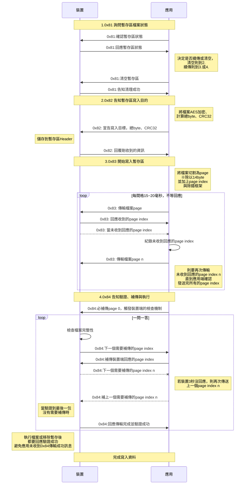
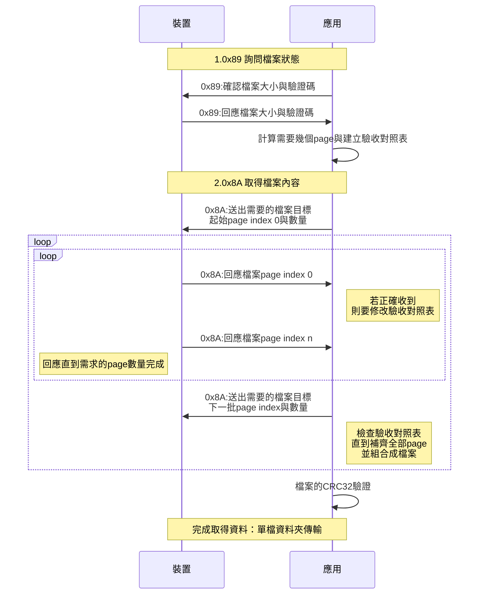
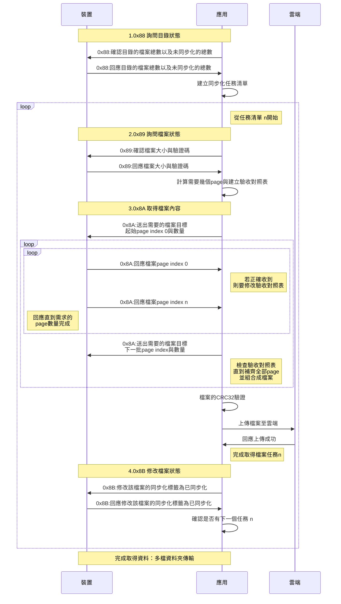

### 版本

| 版本 | 修訂日期   | 修訂內容                                            |
| ---- | ---------- | --------------------------------------------------- |
| 0.1  | 2021/09/29 | 開發工程師新建立文件                                |
| 0.2  | 2021/10/07 | 修訂[寫入資料(A2D)](#寫入資料(A2D))內容、繪製時序圖 |
| 0.3  | 2021/10/08 | 修訂[取得資料(D2A)](#取得資料(D2A))內容、繪製時序圖 |

### 藍牙傳輸協議

> 本**藍牙傳輸協議**目的，為了在`應用端`(*APP或WEB*)，透過**藍牙傳輸協議**來傳送物件(*檔案*)至`裝置端`。且要達到穩定、快速、可靠度、安全性的四項需求。其傳輸的物件(*檔案*)都需經過[AES-128 CBC](#AES-128 CBC)進行加解密

裝置主服務UUID

```
4d500001-4745-5630-3031-e50e24dcca9e
```

Request通訊服務UUID

```
4d500002-4745-5630-3031-e50e24dcca9e
```

Respones通訊服務UUID

```
4d500003-4745-5630-3031-e50e24dcca9e
```


### 除錯框架協定

> 此除錯框架協定僅適用於指令號 0x80~0x8F


| Byte index | 敘述                                                         |
| ---------- | ------------------------------------------------------------ |
| **[0]**    | 開機後的藍牙Rolling Code 循環除錯碼0~255，用於觀察藍牙封包阻塞或順序使用。 |
| **[1]**    | 指令號 TD Index                                              |
| *[2]*      | *Request或Response內容*                                      |
| *...*      | *...*                                                        |
| *[18]*     | *Request或Response內容*                                      |
| **[19]**   | 該封包的[0]~[18]，做成Check sum [XOR](#XOR)                  |


#### AES-128 CBC

**IV**

```
待Primo提供
```

**KEY**

```
待Primo提供
```

------

#### XOR

> XOR(exclusive or) `^`：異或運算。是一種加密演算法，利用了計算機中的異或計算，原理是相同為 0，不同為 1
>
> 0 ^ 0 = 0
>
> 1 ^ 1 = 0
>
> 1 ^ 0 = 1
>
> 0 ^ 1 = 1

例如某一page

```
0xA1,0x81,0x00,0x00,0x00,0x00,0x00,0x00,0x00,0x00,0x00,0x00,0x00,0x00,0x00,0x00,0x00,0x00,0x00,0x20
```

將從第[0]byte開始， 對[1]byte 做xor，將其結果繼續對[2]byte 做xor，依序做到第[18]byte ，將其最後結果存放在第[19]byte 

| byte index | [0]  | [1]  | [0]^[1] | [2]  | [0]\^[1]\^[2] | [3]~[17] | [18] | [0]\^[...]\^[18]=[19] |
| ---------- | ---- | ---- | ------- | ---- | ------------- | -------- | ---- | --------------------- |
| bit index  | 0xA1 | 0x81 | 0x04    | 0x00 | 0x04          | 0x00     | 0x00 | 0x04                  |
| [0]        | 1    | 1    | 1^1=0   | 0    | 0^0=0         | 0        | 0    | 0                     |
| [1]        | 0    | 0    | 0^0=0   | 0    | 0^0=0         | 0        | 0    | 0                     |
| [2]        | 1    | 0    | 1^0=1   | 0    | 1^0=1         | 0        | 0    | 1                     |
| [3]        | 0    | 0    | 0^0=0   | 0    | 0^0=0         | 0        | 0    | 0                     |
| [4]        | 0    | 0    | 0^0=0   | 0    | 0^0=0         | 0        | 0    | 0                     |
| [5]        | 0    | 0    | 0^0=0   | 0    | 0^0=0         | 0        | 0    | 0                     |
| [6]        | 0    | 0    | 0^0=0   | 0    | 0^0=0         | 0        | 0    | 0                     |
| [7]        | 1    | 1    | 1^1=0   | 0    | 0^0=0         | 0        | 0    | 0                     |

------

### 及時狀態回覆

#### 0x80 裝置通用訊息或錯誤回應

- Command number：0x80
- Mode：`notify`
- Description：當使用0x81~0x8F指令中有任何錯誤發生，**裝置**會立即透過本指令主動發出訊息

##### Response Set

| Byte index | 敘述                                         |
| ---------- | -------------------------------------------- |
| [2]        | 發生點0x80~0x88的指令號                      |
| [3]        | 訊息代碼L。可至[訊息代碼](#訊息代碼)查詢內容 |
| [4]        | 訊息代碼H。可至[訊息代碼](#訊息代碼)查詢內容 |

**example**

使用`0x88` 詢問取得檔案狀態還不支援時，`0x80`會立即做出回應，0：不支援的指令，開發期間還未完成的指令預設用0回應

```C
[1]0x80
[2]0x88
[3]0x00
[4]0x00
    ...
```


------

### 寫入資料(A2D)

#### 寫入資料流程圖

本單元流程為應用端寫入檔案到裝置端的流程。

1. [0x81 詢問暫存區檔案狀態](#0x81 詢問暫存區檔案狀態)
2. [0x82 告知暫存區寫入目的](#0x82 告知暫存區寫入目的)
3. [0x83 開始寫入暫存區](#0x83 開始寫入暫存區)
4. [0x84 告知驗證、補傳與執行](#0x84 告知驗證、補傳與執行)



------

#### 0x81 詢問暫存區檔案狀態

- Command number： 0x81
- Mode： `response`
- Description：詢問暫存區是否存在檔案，以及傳輸的進度來決定要不要補傳，也可以清空暫存區。

##### Request set

- Page type： Single page

| Byte index | 敘述                                 |
| ---------- | ------------------------------------ |
| [2]        | 對暫存區要執行的動作。0:查詢、1:清空 |

##### Response set

- Page type： Single page
| Byte index | 敘述                                                         |
| ---------- | ------------------------------------------------------------ |
| [2]        | 對暫存區要執行的動作。0:成功查詢(以下要回應)、1:成功清空     |
| [3]        | 寫入目標的根目錄代號，可至[目錄代號](#目錄代號)查詢。<br />^※當根目錄與子目錄都回應0的話，則代表沒有檔案^ |
| [4]        | 寫入目標的子目錄或子檔案代號，可至[目錄代號](#目錄代號)查詢。<br />^※當根目錄與子目錄都回應0的話，則代表沒有檔案^ |
| [5]        | 裝置已暫存的file byte數: L                                   |
| [6]        | 裝置已暫存的file byte數: M                                   |
| [7]        | 裝置已暫存的file byte數: H                                   |
| [8]        | file 總byte數: L                                             |
| [9]        | file 總byte數: M                                             |
| [10]       | file 總byte數: H                                             |
| [11]       | file Checksum: LL，CRC32                                     |
| [12]       | file Checksum: LH，CRC32                                     |
| [13]       | file Checksum: HL，CRC32                                     |
| [14]       | file Checksum: HH，CRC32                                     |

------

#### 0x82 告知暫存區寫入目的

- Command number： 0x82
- Mode： `response`
- Description：告知要寫入的目的地、動作、檔案大小、CRC32驗證碼

##### Request set

- Page type： Single page
- Description：送出需求

| Byte index | 敘述                                                         |
| ---------- | ------------------------------------------------------------ |
| [2]        | 執行動作。0：還原預設(以下參數就不用帶)、1：部分複寫、2：完全複寫 |
| [3]        | 寫入目標的根目錄代號，可至[目錄代號](#目錄代號)查詢          |
| [4]        | 寫入目標的子目錄或子檔案代號，可至[目錄代號](#目錄代號)查詢  |
| [5]        | file 總byte數: L                                             |
| [6]        | file 總byte數: M                                             |
| [7]        | file 總byte數: H                                             |
| [8]        | file Checksum: LL，CRC32                                     |
| [9]        | file Checksum: LH，CRC32                                     |
| [10]       | file Checksum: HL，CRC32                                     |
| [11]       | file Checksum: HH，CRC32                                     |

##### Response set

- Page type： Single page
- Description：回應需求

| Byte index | 敘述                                                         |
| ---------- | ------------------------------------------------------------ |
| [2]        | 回應執行動作。0：還原預設(以下參數就不用帶)、1：部分複寫、2：完全複寫 |
| [3]        | 回應寫入目標的根目錄代號，可至[目錄代號](#目錄代號)查詢      |
| [4]        | 回應寫入目標的子目錄或子檔案代號，可至[目錄代號](#目錄代號)查詢 |
| [5]        | file 總byte數: L                                             |
| [6]        | file 總byte數: M                                             |
| [7]        | file 總byte數: H                                             |
| [8]        | file Checksum: LL，CRC32                                     |
| [9]        | file Checksum: LH，CRC32                                     |
| [10]       | file Checksum: HL，CRC32                                     |
| [11]       | file Checksum: HH，CRC32                                     |

#### 0x83 開始寫入暫存區

- Command number： 0x83
- Mode：`response`
- Description：根據[0x82 告知暫存區寫入目的](#0x82 告知暫存區寫入目的)，開始寫入到暫存區

##### Request set

- Page type： Array page

| Byte index | 敘述              |
| ---------- | ----------------- |
| [2]        | file page index L |
| [3]        | file page index M |
| [4]        | file page index H |
| [5]        | 資料切割內容      |
| [...]      | ...               |
| [18]       | 資料切割內容      |


##### Response set 

- Page type： Single page
- Description：回應接到page的index，若APP未收到某一page的index，就可以當作此封包丟失，直接用0x83再丟。

| Byte index | 敘述              |
| ---------- | ----------------- |
| [2]        | file page index L |
| [3]        | file page index M |
| [4]        | file page index H |

------

#### 0x84 告知驗證、補傳與執行

- Command number： 0x84
- Mode：`response`
- Description： APP帶任意File page index 的補資料Request，都會以該page indeX為起點，觸發往下檢查補page機制。根據Response結果來補page index檔案，Response到回應成功為止。**若為首次進入驗證流程，必定使用File page index 0來做觸發檢查機制**。

##### Request set

- Page type： Single page
- Description： APP首次進入驗證流程要帶page index 0的補資料，來觸發裝置的檢查機制。若裝置中途停止不回應，則再丟一次上次Response 需求。

| Byte index | 敘述              |
| ---------- | ----------------- |
| [2]        | file page index L |
| [3]        | file page index M |
| [4]        | file page index H |
| [5]        | 資料切割內容      |
| [...]      | ...               |
| [18]       | 資料切割內容      |

##### Response set

- Page type： Array page
- Description：可連續丟好幾頁，直到裝置回覆驗證成功

| Byte index | 敘述                                                         |
| ---------- | ------------------------------------------------------------ |
| [2]        | 驗證結果。0x00:缺Page並要帶下列資訊、0x01：驗證成功、0x02無法安裝 |
| [3]        | 要補的資料page index L                                       |
| [4]        | 要補的資料page index M                                       |
| [5]        | 要補的資料page index H                                       |


------


### 取得資料(D2A)

#### 取得資料流程圖

本單元流程為應用端取得裝置端檔案的流程，並且分為`單檔傳輸流程`與`多檔傳輸流程`。

> 單檔案傳輸：單檔案傳輸，通常`應用端`在**每次任務都需要**取得檔案內容，或上傳至雲端。
> 例如：裝置設定檔、使用者設定檔...等

> 多檔案傳輸：多檔案傳輸有同步標籤的概念，通常用於本次任務取的檔案，上傳至雲端後，**下一次任務就不再取相同的檔案**。
> 例如：系統日誌檔、運動檔案...等

##### 單檔傳輸流程

1. [0x89 詢問檔案狀態](#0x89 詢問檔案狀態)
2. [0x8A 取得檔案內容](#0x8A 取得檔案內容)

##### 多檔傳輸流程

1. [0x88 詢問目錄狀態](#0x88 詢問目錄狀態)
2. [0x89 詢問檔案狀態](#0x89 詢問檔案狀態)
3. [0x8A 取得檔案內容](#0x8A 取得檔案內容)
4. [0x8B 修改檔案狀態](#0x8B 修改檔案狀態)



------

#### 0x88 詢問目錄狀態

- Command number： 0x88
- Mode： `response`
- Description：確認多檔資料夾的檔案與未同步化總數。

##### Request

- Page type： Single page
- Description：帶入想要取得的目錄

| Byte index | 敘述                                                |
| ---------- | --------------------------------------------------- |
| [2]        | 詢問目標的根目錄代號，可至[目錄代號](#目錄代號)查詢 |
| [3]        | 詢問目標的子目錄代號，可至[目錄代號](#目錄代號)查詢 |

##### Response

- Page type： Single page
- Description：回應目錄狀態

| Byte index | 敘述                                                         |
| ---------- | ------------------------------------------------------------ |
| [2]        | 回覆根目錄代號，可至[目錄代號](#目錄代號)查詢                |
| [3]        | 回覆子目錄代號，可至[目錄代號](#目錄代號)查詢                |
| [4]        | 回應子目錄中的未同步化檔案數量，最大為255。若為單檔資料夾則總是回1 |
| [5]        | 回應子目錄中的檔案數量，最大為255。若為單檔資料夾則總是回1   |

------

#### 0x89 詢問檔案狀態

- Command number： 0x89
- Mode： `response`
- Description：確認檔案狀態清單，並可用Array的方式回覆：包含index、總byte數、同步化標籤。在Response中間SG會去收集相關資訊，此Index的Time out要長一點。

##### Request

- Page type： Single page
- Description：帶入取得資料的類型，並且可以在0x89指定從哪邊開始要，以及資料量

| Byte index | 敘述                                                         |
| ---------- | ------------------------------------------------------------ |
| [2]        | 詢問目標的根目錄代號，可至[目錄代號](#目錄代號)查詢          |
| [3]        | 詢問目標的子目錄代號，可至[目錄代號](#目錄代號)查詢          |
| [4]        | 詢問起始點的檔案Index ，多檔資料夾才會用到此參數。單檔資料夾只會有1 |
| [5]        | 詢問回應的頁數，多檔資料夾才會用到此參數。單檔資料夾只會有1  |

##### Response

- Page type： Array page
- Description：這邊會根據Request的需求數量，則會連續丟Array，也可根據Request需求數量來驗證回應數量對不對，用來補傳0x89。

| Byte index | 敘述                                                         |
| ---------- | ------------------------------------------------------------ |
| [2]        | 檔案index                                                    |
| [3]        | byte數:L                                                     |
| [4]        | byte數:M                                                     |
| [5]        | byte數:H                                                     |
| [6]        | Checksum:LL，CRC32                                           |
| [7]        | Checksum:LH，CRC32                                           |
| [8]        | Checksum:HL，CRC32                                           |
| [9]        | Checksum:HH，CRC32                                           |
| [10]       | 同步化標籤，0x00:未同步、0x01：已同步，多檔資料夾才會用到此參數，用來判斷是否略過同步化。單檔資料夾通常都會值直接同步化。 |

...

| Array page |
| ---------- |


------

#### 0x8A 取得檔案內容

- Command number：0x86
- Mode：`Ride`,`Service`
- Description：`接收端`可依照`發送端`封包回傳情況，來控制流量(array page)或時間間隔，`發送端`的最佳狀態每次可回傳的**流量上限為30個page**

##### Request

- Page type：Single page
- Description：提出檔案需求，可定址到檔案index與該筆檔案page index

| Byte index | 敘述                                                         |
| ---------- | ------------------------------------------------------------ |
| [2]        | 詢問目標的根目錄代號，可至[目錄代號](#目錄代號)查詢          |
| [3]        | 詢問目標的子目錄或子檔案代號，可至[目錄代號](#目錄代號)查詢  |
| [4]        | 檔案index                                                    |
| [5]        | 檔案page index L                                             |
| [6]        | 檔案page index M                                             |
| [7]        | 檔案page index H                                             |
| [8]        | 檔案page Response的Array page數量，`需求端`可用來控制`發送端`的回應速度 |

##### Response

- Page type：Array page
- Description：需要傳的Array Page數
- 是由Request`[8] //檔案page Response的Array page數量`來決定

| Byte index | 敘述             |
| ---------- | ---------------- |
| [2]        | 檔案index        |
| [3]        | 檔案page index L |
| [4]        | 檔案page index M |
| [5]        | 檔案page index H |
| [6]        | 資料切割內容     |
| [...]      | ...              |
| [18]       | 資料切割內容     |

...

| Array page |
| ---------- |

------

#### 0x8B 修改檔案狀態

- Command number： 0x8B
- Mode：`response`
- Description：當多檔案同步完成，可修改多檔案的同步化標籤，改為已同步。避免下次再次同步化。通常單檔資料夾不會去修改同步化狀態，裝置端也不會被此指令所修改成未同步。

##### Request

- Page type： Single page
- Description：送出修改需求的index與數量

| Byte index | 敘述                                                |
| ---------- | --------------------------------------------------- |
| [2]        | 修改目標的根目錄代號，可至[目錄代號](#目錄代號)查詢 |
| [3]        | 修改目標的子目錄代號，可至[目錄代號](#目錄代號)查詢 |
| [4]        | 修改檔案的起始index                                 |
| [5]        | 修改的數量                                          |
| [6]        | 要將同步化標籤修改為0:已同步化、1:未同步            |

##### Response

- Page type： Single page
- Description：要回應同Request的內容

| Byte index | 敘述                                                |
| ---------- | --------------------------------------------------- |
| [2]        | 修改目標的根目錄代號，可至[目錄代號](#目錄代號)查詢 |
| [3]        | 修改目標的子目錄代號，可至[目錄代號](#目錄代號)查詢 |
| [4]        | 修改檔案的起始index                                 |
| [5]        | 修改的數量                                          |
| [6]        | 要將同步化標籤修改為0:已同步化、1:未同步化          |

------

### 附表

#### 目錄代號

檔案內容的宣告則在[GIANT_HPB_資料交換宣告[ver_0.1].html](GIANT_HPB_資料交換宣告[ver_0.1].html)中敘述

| 根目錄代碼 | 子目錄代碼 | 對應的路徑檔            | 類型       | 用途                                                         |
| ---------- | ---------- | ----------------------- | ---------- | ------------------------------------------------------------ |
| 0          | 0          | null                    | null       | 系統用來宣告無檔案，[寫入暫存區](#0x81 詢問暫存區檔案狀態)會用到 |
| 0          | 1          | system/iotProfile.json  | 單檔資料夾 | IoT 所使用的Host、Port、金鑰...等                            |
| 0          | 2          | system/esimProfile.josn | 單檔資料夾 | eSIM 的設置檔                                                |
| 0          | 3          | system/log/***.json     | 多檔資料夾 | 系統日誌                                                     |

#### 訊息代碼

[0x80 裝置通用訊息或錯誤回應](#0x80 裝置通用訊息或錯誤回應)的訊息代號內容

| Message code | 內容                                            |
| ------------ | ----------------------------------------------- |
| 0            | 不支援的指令，開發期間還未完成的指令預設用0回應 |
| 1            | 有支援的指令，但參數不支援或錯誤                |